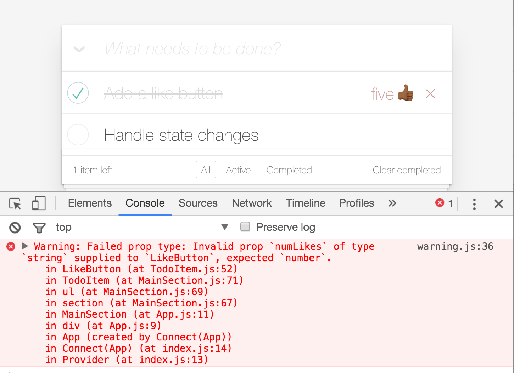

# Lesson 1
## Lesson 1.1 - Add a like button component
1. _(In src/components)_ Create a new file called `LikeButton.js`
2. Import some really basic stuff here
  * Import React itself, and Component and PropTypes
  * What is Import?
3. Export your like button class as the default and extend Component
4. Add a `render` function
  * You will need a div to show the number of likes. Add a static number of likes for now as seen in the below code snippet.
  * You will need a button to enable liking the todo. Use your favorite emoji as the text.
```
<div className="like">
  <div className="numLikes">
    9
  </div>            
  <button className="likeTodo">👍</button>
</div>
```
5. Import `LikeButton` at the top of the `TodoItem` component.
6. Insert your like button before the destroy button.
```
<LikeButton />
```
7. Save your files and check it out in the browser.

## Lesson 1.2 - Use a variable for likes.
Now we’ll make the number of likes pull from an initial state, at the end the number of likes.
1. _(In [TodoItem.js](src/components/TodoItem.js))_ Add an initial state for `numLikes` of `0` to the `state` class initializer property
```
state = {
  numLikes: 0,
  editing: false
}
```
2. Now let’s pass `this.state.numLikes` and `todo.id` as props into `LikeButton` named `numLikes` and `id` respectively.
```
<LikeButton numLikes={this.state.numLikes} id={todo.id} />
```
3. _(In LikeButton.js)_ Use an expression to show `numLikes`. Replace the number `9` with:
```
{this.props.numLikes}
```
4. Save the file and check out your browser. You should see a `0` next to the like button.
  * At this point we could pass anything into numLikes. A string, a number, even an array. To protect from incorrect props being passed, React provides the concept of propTypes. PropTypes allows a component to declare the expected types for each prop, throwing an helpful error if an unexpected type is received.
5. _(In [TodoItem.js](src/components/TodoItem.js))_ Change the `numLikes` prop in the `LikeButton` element to a string like `“five”`.
```
<LikeButton numLikes={“five”} id={todo.id} />
```
6. Save the file, open the browser. You should see `“five”` next to each like button. That’s not good!
7. _(In LikeButton.js)_ Create a static class object called `propTypes` and set `numLikes` and `id` as numbers that are required.
```
static propTypes = {
  numLikes: PropTypes.number.isRequired
}
```
8. Save the file, open the browser with the developer console open. You should see a warning like this:

9. _(In [TodoItem.js](src/components/TodoItem.js))_  Set the numLikes prop back to passing the state.
```
<LikeButton numLikes={this.state.numLikes} id={todo.id} />
```
10. Save the file, open the browser and see a `0` next to the like button.

## Stretch Goals:
* 🥉 BRONZE: Use object destructuring in the like button component to destructure the `numLikes` prop.
* 🥈 SILVER: Write an onClick handler on the `likeTodo` button that shows an alert with the todo `id`.
* 🏅 GOLD: This component has no lifecycle methods like `shouldComponentUpdate`, or `componentDidMount`. Because of this, it does not need to extend Component. It can simply be a function that returns JSX. Make `LikeButton` an arrow function that receives the props as destructured parameters and returns JSX. Assign the `propTypes` to the function and export it.
